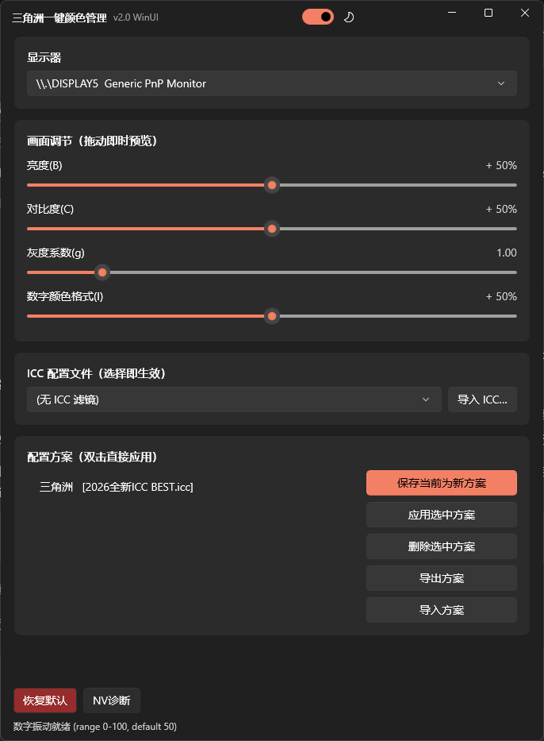
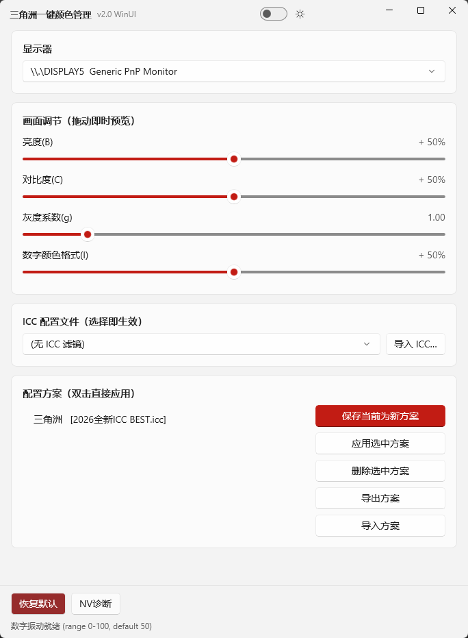

# 三角洲一键颜色管理 v2.0 (WinUI 3)

 **游戏 ICC 滤镜 + NVIDIA 数字振动 + 显卡 LUT 调色**工具，主要为《三角洲行动》设计。不会像 N 卡滤镜一样掉帧。所有调节即时生效，不依赖系统颜色管理面板，一键切换游戏视觉方案。

v2.0 使用 **WinUI 3 (Windows App SDK 1.8)** 全面重构界面：原生 Fluent Design 质感、深色/浅色双主题、沉浸式标题栏、卡片式布局、滑动开关。

<p align="center">
  
</p>

---

## 功能特性

| 功能 | 说明 |
|------|------|
| **ICC 滤镜即时应用** | 下拉选中即生效，走完整 WCS 链路（注册 / 关联 / 默认 / LUT 写入），与 Windows 颜色管理面板行为一致 |
| **亮度 / 对比度 / 灰度** | 通过显卡伽马表（LUT）实时调色，0 延迟，全屏游戏内同样生效 |
| **数字振动 (NVIDIA)** | 读取/设置显卡 DVC，仅 NVIDIA 显卡可用，无 N 卡自动禁用 |
| **配置方案** | 保存整套参数为一键方案，支持**导出/导入**，可分享给队友 |
| **导入 ICC 文件** | 把外部 `.icc` / `.icm` 一键装进系统颜色目录 |
| **恢复默认** | 一键回到系统级默认状态，并清除用户级 ICC 关联（自生成 DCM Default.icm 作 identity LUT 基线） |
| **深色 / 浅色主题** | 标题栏滑动开关即时切换，自动记忆上次选择 |
| **窗口居中启动** | 在所在显示器的工作区内居中（避开任务栏） |

---

## 界面预览

> 深色 / 浅色双主题

<p align="center">
  
</p>
<p align="center">
  
</p>

---

## 下载与运行

在 [Releases](https://github.com/you20cc/DeltaColorManager/releases) 页面下载最新版压缩包，**解压后**直接运行 `DeltaColorManager.exe`。

> **系统要求**：Windows 10 1809+ / 11，64 位
>
> **零依赖**：本程序为**自包含**发布，.NET 运行时与 Windows App SDK 一起打包进程序目录，**用户机器无需安装任何运行时**，解压即用。

---

## 推荐资源

| 资源 | 获取方式 |
|------|----------|
| **ICC 文件**《2026全新ICC BEST.icc》 | 去抖音搜索 **「老六不六（三角洲行动）」** 自行获取（本项目不提供、不分发该 ICC 文件） |
| **推荐方案** `三角洲.dcolor` | 本仓库 / Release 中下载（方案需要：2026全新ICC BEST.icc） |

---

## 食用方法（按顺序来）

### 1. 导入 ICC 文件
1. 运行 `DeltaColorManager.exe`
2. 在 **ICC 配置文件** 卡片中，点击右侧 **「导入 ICC…」**
3. 选择你从抖音获取的 `2026全新ICC BEST.icc` → 确定
4. ICC 会出现在下拉框中

### 2. 导入推荐方案
1. 在 **配置方案** 卡片中，点击 **「导入方案」**
2. 选择 `三角洲.dcolor` → 确定
3. 列表中会出现「三角洲」方案

### 3. 应用方案
1. 选中列表中的 **「三角洲」**
2. 单击 **「应用选中方案」**，或 **双击** 列表项
3. 屏幕立即生效，进游戏即可

> 你也可以手动拖动滑条微调，或保存为自己的新方案后再导出分享。深色/浅色主题用右上角的滑动开关切换，选择会被记住。

---

## 项目结构

```
DeltaColorManager.WinUI/
  DeltaColorManager.WinUI.csproj   工程配置(WinUI 3 / 自包含 / 非打包)
  App.xaml / App.xaml.cs           应用入口 + 全局异常钩子
  MainWindow.xaml / .cs            主界面(深色/浅色双主题 + 自定义标题栏)
  app.manifest                     应用清单(高 DPI 支持)
  app.ico                          软件图标
  assets/
    runtime/                       随包的 VC++ 运行库(msvcp140 / vcruntime140 等)
  Core/                            核心逻辑层(与 WinForms 版完全一致)
    Native.cs                      WCS(mscms) + 显卡 LUT P/Invoke、显示器枚举
    NvApi.cs                       NVIDIA 数字振动动态调用
    IccManager.cs                  ICC 列举 + vcgt 标签解析
    GammaLut.cs                    亮度/对比度/灰度 LUT 合成管线
    ProfileStore.cs                方案 JSON 存取(%AppData%\DeltaColorManager\profiles.json)
```

---

## 自行编译

1. 将本仓库克隆到本地
2. 安装 **Visual Studio 2026 Community**，勾选工作负载：
   - **.NET 桌面开发**
   - **WinUI 应用程序开发**
3. 打开 `DeltaColorManager.WinUI.csproj`
4. 首次还原 NuGet 包（需联网，拉取 Windows App SDK 1.8 等）
5. 配置 **Release** + **x64** → 生成
6. 产物在 `bin\x64\Release\net8.0-windows10.0.19041.0\`，整个文件夹即为可分发的绿色版

> 也支持命令行：`dotnet build -c Release -p:Platform=x64`（需要 .NET 10 SDK）

---

## 技术说明

- 所有颜色调节通过 **显卡 LUT (SetDeviceGammaRamp)** 实现，对游戏画面无额外性能开销
- ICC 滤镜通过 **Windows Color System (mscms.dll)** 注册，同时解析 `vcgt` 标签直接写 LUT 即时生效
- 普通调节完全走 **HKCU**（当前用户），无需管理员权限；仅「导入 ICC」需管理员以写入系统颜色目录
- 「恢复默认」自生成 `DCM Default.icm` 作为 identity LUT 基线，对齐 [filter-manage](https://github.com/q974491089/filter-manage) 的「恢复默认」行为
- HDR 开启时，系统 HDR 合成管线可能覆盖 LUT 调节，属已知 Windows 限制
- 自包含发布需手动携带 VC++ 运行库（`assets/runtime`），缺 msvcp140.dll 在干净机器上启动即闪退

---

## 与 v1.x (WinForms) 的关系

v2.0 与 v1.x 共享同一套 `Core` 层，**数据完全互通**：
- 方案库：`%AppData%\DeltaColorManager\profiles.json`
- 应用日志：`%AppData%\DeltaColorManager\apply.log`
- 主题偏好：`%AppData%\DeltaColorManager\settings.json`（v2.0 新增）
- 自生成 ICC：`%AppData%\DeltaColorManager\DCM Default.icm`

两版可同时安装、交替使用，互不冲突。v1.x 是轻量框架依赖版（约 300 KB，需装 .NET 10），v2.0 是全自包含 Fluent 版（约 141 MB，零依赖）。

---

## 致谢

- 推荐 ICC 出处：抖音 **老六不六（三角洲行动）**
- 参考/对照项目：[filter-manage](https://github.com/q974491089/filter-manage)（Rust / ICC WCS 应用链路）
- UI 框架：[WinUI 3 / Windows App SDK](https://github.com/microsoft/WindowsAppSDK)
- 有问题提 issue，有事联系 q：2281808559

---

## 开源许可

本项目采用 [MIT License](LICENSE)。
